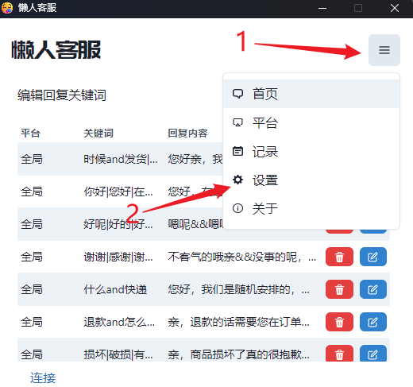
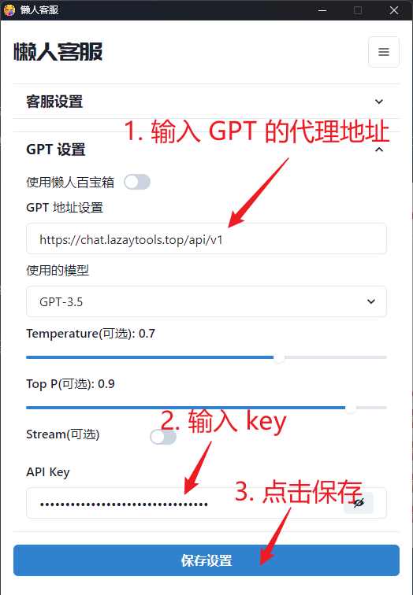
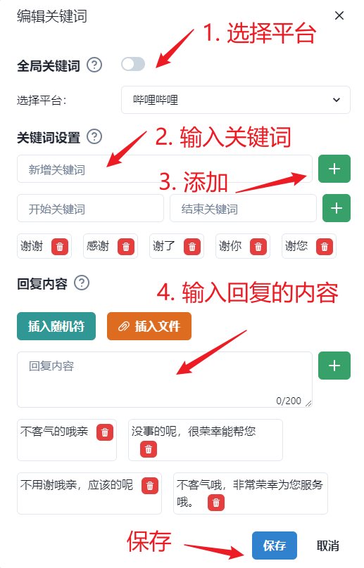

# Lazy customer service   
**English** · [中文](README.md) 

This project is an intelligent customer service tool based on large models, supporting access to platforms such as WeChat, Taobao, Bilibili, Douyin Enterprise Account, Douyin, Douyin Store, Weibo Chat, Xiaohongshu Professional Account Operation, Xiaohongshu, Zhihu, etc. It can choose GPT3.5/GPT4.0 (more platforms will be supported in the future), handle text, voice, and images, access external resources such as operating systems and the Internet through plugins, and support customization of enterprise AI applications based on its own knowledge base.

**Note** : This project is just a customer service tool for connecting to external platforms and does not provide any platform accounts, which need to be prepared by yourself. Additionally, the knowledge base function also needs to be prepared by yourself. Currently, this project only supports integration with OpenAI's API interface (or proxy).

* [GitHub] https://github.com/lrhh123/ChatGPT-On-CS
* [Gitee] https://gitee.com/alsritter/ChatGPT-On-CS · (国内用户推荐)

# Main function
- [x] Multi-platform support: Currently supports platforms such as WeChat, Taobao, Bilibili, Douyin Enterprise Account, Douyin, Dou Store, Weibo Chat, Xiaohongshu Professional Account Management, Xiaohongshu, Zhihu, and more. Will continue to expand support for more social media platforms in the future.
- [x] Default reply content: Allows users to set custom replies to solve common issues and improve response efficiency.
- [x] Access to the ChatGPT interface, generates replies intelligently based on customer inquiries, suitable for handling complex or personalized customer inquiries.
- [x] Sending images and binary files: Supports sending images and other binary files to meet the customer service needs of simulators.
- [x] Knowledge base: Customize the robot by uploading knowledge base files, can be used as a digital clone, intelligent customer service, or private domain assistant.
- [x] Each platform has an independent plugin system, supports plugins accessing external resources such as the internet, and supports enterprise AI applications customized based on proprietary knowledge bases.

# Presentation video
[Watch video](https://www.bilibili.com/video/BV1qz421Q73S)

# Open source community
If you have any feedback or features you would like to support for the project, you can add the assistant's WeChat to join the open source project discussion group:

<!-- 

# Business support
We also provide an enterprise-level AI application platform, including capabilities such as knowledge base, Agent plugins, application management, supporting multi-platform aggregated application access, client management, conversation management, and providing various modes such as SaaS services, private deployment, stable hosting access, etc.

Currently, we have accumulated rich AI solutions in scenarios such as private domain operation, intelligent customer service, and enterprise efficiency assistants. We have also developed best practices for AI implementation in various industries such as e-commerce, education, health, and new consumption. We are committed to building a one-stop platform to help small and medium-sized enterprises embrace AI. For enterprise services and commercial consulting, please contact our product consultants.

 -->

# Download link
<a href="https://github.com/lrhh123/ChatGPT-On-CS/releases/download/v1.0.2/1.0.2.exe" style="display: inline-block; background-color: #008CBA; color: white; padding: 10px 20px; text-align: center; text-decoration: none; font-weight: bold; border-radius: 5px; margin: 4px 2px; cursor: pointer;">download</a>

# Instructions
The first startup may be a bit slow as it needs to download driver files and initialize the reply database, so please be patient.

### 1. Set up GPT Address
After launching the program, click on the settings button, set up your OpenAPI Key and proxy server address, then click save.

### 2. Instructions for Homepage Operations
First, you can see the "Connection" section on the homepage, with two checkboxes. By default, the software is paused. If you want the software to start working, uncheck this checkbox.

When first opened, it defaults to not being logged in. So, you need to manually pause it, then log in, and then uncheck the pause to start working.

After enabling automatic replies, it will read the platforms you have selected below and automatically open those pages to start working. Note that the checkboxes above cannot be clicked because the author does not have accounts for those platforms, so they cannot debug the platform's information. If you have accounts for these platforms and need support for automatic replies, please contact the customer service above.

### 3. Writing Keywords
When the "Enable Keyword Matching" above is checked, it will prioritize matching the keywords set here. If a keyword is matched, it will reply with the corresponding reply. If no keyword is matched, it will call on you to provide the ChatGPT API at the bottom to ask GPT to answer the user's question.

Clicking the "Add Keyword" button allows you to customize keywords and reply content.

You can add several matching keywords.

**Writing Rule Keywords**
- `Hello`：It will reply with the response you set whenever the user inputs "Hello".

- `Hello*`：For fuzzy matching using the * symbol. For example, "Hello*", whenever the user inputs something like "Hello", it will reply with the response you set.

- `*Hello*`：If the set keyword is "Hello", then whenever the user's input contains

**Special Case**： If you use the "Start Keyword" and "End Keyword" below, then the user's input only needs to start with the "Start Keyword" and end with the "End Keyword" to match the keywords you've set up.

### 4. Writing Replies
- `Keyword rules：`You can correspond to multiple reply contents. When a keyword is matched, it will randomly select one as the reply content.

- `Insert random symbols：` This is because platforms like Pinduoduo do not allow repeating the same answer each time, so you can insert a random symbol to avoid this issue.

- `Insert file：` This is mainly used for inserting images. You can insert the link to an image, allowing you to reply with a picture.

### 5. Platform Independent ChatGPT API Settings
Sometimes, we might need to set different ChatGPT API addresses for different platforms. You can do this here. You can create your own knowledge base based on [Lazy person's treasure trove](https://chat.lazaytools.top/) and then set it here.

When a platform-specific ChatGPT API address is set, it will prioritize using this address to call the ChatGPT API. If not set, it will use the global ChatGPT API address set above.
### 6. Customer Service Related Settings

**Extract Information**: When selected for extracting phone numbers or querying product names, it will extract the phone number or product name from the user's message and store it in the path below.

**Wait for Reply Time**: After a user sends a message, it will wait this long before replying. If you want an immediate reply, you can set this value to zero.

**Context Message Count**: When using the ChatGPT API, it will take a specified number of chat contexts to call the ChatGPT API, helping the ChatGPT API better understand the user's questions. Note that the larger this value, the slower the call to the ChatGPT API.

**Wait for Manual Interval**: When encountering ChatGPT blocking, it will wait this long before terminating the automatic customer service task and transferring it to manual customer service for manual processing.

## Project Plan
- [ ] Support platforms such as Pinduoduo, Taobao, JD.com, and other e-commerce platforms (if urgent, please private message the assistant).
- [ ] Support loading local models.
